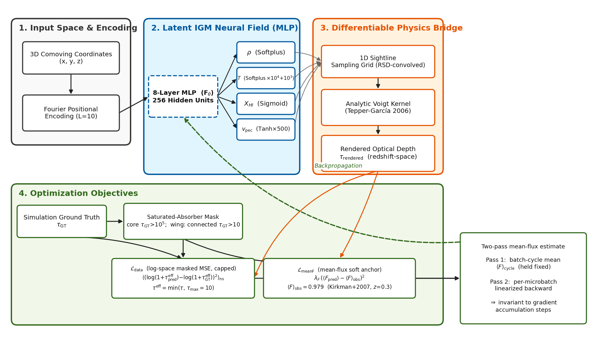

# cosmo-gas-fields

Neural fields and differentiable line rendering for reconstructing the 3D density of
intergalactic gas from sparse one-dimensional absorption spectra, plus the
identifiability diagnostic, the evaluation protocol, and the MLOps patterns that were
needed to make the result trustworthy.

This is a curated, self-contained release of the research code. It runs on CPU on
synthetic data in under a minute (`examples/synthetic_demo.py`). The simulation data
used in the paper is not included; see *Data* below.

## The problem

Light from distant quasars passes through clouds of hydrogen gas. Each cloud absorbs a
little light at one wavelength, so the spectrum of a quasar is a one-dimensional
"skewer" through the gas: dense gas gives deep absorption, thin gas gives shallow
absorption. Given a few hundred skewers through a volume, we want the full 3D density
field between them.

The forward model is physical and known: density, temperature, neutral fraction, and
line-of-sight velocity along a skewer determine the optical depth tau(v) through a
Voigt line profile, and the observed flux is exp(-tau). The inverse problem is
under-determined (most of the volume is far from any skewer) and non-linear (saturated
absorbers hide the density behind them).

We train and evaluate on a public cosmological simulation suite: hydrodynamic runs of
a periodic box with several physics variants, from which true density cubes and
synthetic spectra are extracted at a low redshift.

## Method



1. **Neural field** (`models/neural_field.py`, `IGMNeRF`). A coordinate MLP with Fourier
   positional encoding maps a 3D position in the unit cube to four physical fields:
   overdensity (softplus, or a log-space head), temperature (softplus, scaled),
   neutral fraction (sigmoid), peculiar velocity (tanh, scaled). Optional per-variant
   embeddings let one field fit several simulation variants jointly.
2. **Differentiable Voigt renderer** (`volume_render_physics`). The four fields sampled
   along a skewer are turned into tau(v): each source bin contributes a Voigt profile
   (Tepper-Garcia 2006 approximation with a stable small-|x| branch) centered at its
   velocity plus its peculiar velocity, evaluated on a window of observed bins and
   scatter-added. A free amplitude `tau_amp` absorbs the mean column. Everything is
   autograd-live, so a loss on the spectrum back-propagates to the field.
3. **Explicit baseline** (`models/voxel_grid_field.py`, `VoxelGridField`). The same
   four-field contract implemented as trilinearly interpolated dense grids. It plugs
   into the renderer unchanged and answers "is the MLP's inductive bias the bottleneck,
   or the objective?"
4. **Amortized inversion** (`models/unet3d.py`). A 3D U-Net that maps rasterized skewers
   (flux contrast on ray voxels + ray mask) to a density crop in one forward pass,
   trained on truth cubes. `models/cnn3d.py` holds a 3D ResNet and moment baselines used
   as measurement instruments for how distinguishable the physics variants are.

## Losses (`training/`)

* `masked_log1p_mse` — MSE on log(1 + tau) with a cap on tau and a per-bin mask.
  The log compresses the heavy absorption tail; the cap stops the loss from chasing
  values where exp(-tau) is numerically zero; the mask excludes damped systems.
* Mean-flux anchor — a soft constraint on the global mean transmitted flux, which fixes
  the amplitude degeneracy between the field and `tau_amp`. Implemented as a two-pass
  linearization so it is exact under gradient accumulation with bounded memory.
* `flux_power_loss.py` — a differentiable flux power spectrum P_F(k) (tested equal to
  the NumPy evaluation estimator), a log-MSE over an inertial k band with the ray
  average taken inside the log, an inverse-variance-weighted variant, a segment-averaged
  cross-coherence diagnostic, and a two-task **GradNorm** balancer that uses
  second-order autograd through the FFT graph.

## The identifiability diagnostic (`diagnostics/truth_scoring.py`)

Before believing a low training loss, ask what loss the *true* field would get.
`score_truth_under_loss` samples the true fields along the training rays, renders them
with the same renderer, scans the free amplitude, and returns the minimum loss: the
truth floor. It also checks wiring (truth against its own rendering must score exactly
zero) and can build a capacity-matched truth by projecting the true fields onto the
basis a coarse grid can represent.

`identifiability_margin = truth_floor / model_loss`. If a model reaches a loss far
*below* what the truth scores, the objective is rewarding something other than the
truth. In that regime a lower loss is not evidence of a better reconstruction, and the
correct conclusion is that the loss does not identify the field, not that the model is
good. This diagnostic is cheap, model-agnostic, and should be run before any training
sweep.

## Evaluation protocol (`analysis/`)

Reconstructions are scored against the true density cube in log space.

* **r_s(sigma)** — Pearson correlation after Gaussian-smoothing both cubes at several
  scales (smoothing on the full periodic cube, mask applied after). Reported as a ladder.
* **r(k)** — Fourier-space cross-coherence per k shell, and the first k where it drops
  below 0.5. `slab_coherence.py` gives a Hann-windowed version for a held-out slab
  that is no longer periodic, with an identity gate (truth vs truth = 1) and a null
  gate (truth vs phase-scrambled truth ~ 0).
* **Chance floor** — the phase-randomized null: same power spectrum as the truth, random
  phases. A reconstruction that only reproduces two-point statistics scores here.
  Reported as a band (mean +/- 3 SD over draws).
* **Achievable ceiling** — controls such as a sharp low-pass of the truth, which show
  what a perfect band-limited reconstruction would score.
* **Inference** — Fisher-z paired t over octants and a paired block bootstrap for the
  difference between two reconstructions.
* Held-out evaluation uses a sealed slab of the box that never intersects a training
  ray; all four simulation variants are scored, not only the fiducial one.

## MLOps patterns (`mlops/`)

Each module's docstring names the failure it prevents.

* `tracker.py` — `Tracker` wraps MLflow with a `nullcontext` fallback and mirrors every
  metric to a local CSV unconditionally, so a worker with no route to the tracking
  server still leaves a record.
* `mlflow_replay.py` — replays an offline `file://` MLflow store into a tracking server
  with full per-step metric history, tags, params, artifacts, and terminal status.
  Used to bring runs back from the HPC cluster.
* `identity_pin.py` — hash pins for every load-bearing input artifact, checked at load;
  a mismatch raises a `SystemExit` subclass so it cannot be swallowed.
* `contract_tests.py` — `overfit_one_batch` (loss must drop 10x on two examples in 50
  steps) and `assert_step_contract` (at a fixed early step the prediction must have
  non-trivial spread and the loss must be below its start), to be called inside the
  loop outside any `try`.

Other conventions used in the research pipeline and worth copying: stage-prefixed run
names with a mandatory tag set (model type, stage, data variant, seed, git commit);
large artifacts tracked by hash in a data-versioning tool; dispatch scripts that assert
the existence of every artifact a downstream consumer needs before cleaning up, and
never `|| true` on those lines.

## Results

<!-- results table: added after review period -->

Qualitatively: the truth-scoring diagnostic showed that the flux-domain objective used
for the neural field does not identify the density field at the resolution studied; a
capacity-matched explicit grid trained under the same loss reaches a loss well below the
truth floor while recovering only large-scale structure. The amortized U-Net inverter,
trained with direct supervision on truth cubes, recovers the smoothed density on the
held-out slab far above the phase-randomized chance floor. Numbers, per-variant tables,
and figures will be added here once the review period ends.

## Tech stack of the full research pipeline

This release runs its demo and tests on CPU, but the original research code behind it
ran as a full training-and-evaluation pipeline:

- **PyTorch (CUDA)** end to end: the neural field, the differentiable absorption
  renderer, the 3D U-Net, and every loss are torch modules; production trainings ran as
  single-GPU jobs on NVIDIA A30 (and H100) nodes, roughly 7 GPU-hours per 50,000-step
  run per simulation box. Apple-silicon MPS and CPU were used for local smokes.
- **SLURM on an institutional HPC cluster** for dispatch: sbatch scripts with in-script
  provenance guards (the job aborts unless the checked-out commit, data checksums, and
  required CLI flags match the registered configuration), a copy-in / compute /
  copy-out / clean-up scratch discipline, and an overfit-one-batch plus step-100
  contract test gating every submission (`mlops/contract_tests.py`).
- **MLflow** for experiment tracking: a self-hosted tracking server backed by SQLite
  with S3 artifact storage; cluster jobs log to a local `file://` store that is shipped
  home and replayed into the tracker with per-step metric history intact
  (`mlops/mlflow_replay.py`); every run degrades gracefully to a CSV mirror when the
  tracker is unreachable (`mlops/tracker.py`).
- **DVC with an S3 remote (AWS)** for data and model versioning: multi-gigabyte
  simulation inputs, truth cubes, and checkpoints are content-addressed, and evaluation
  scripts assert pinned checksums before scoring (`mlops/identity_pin.py`) so a stale
  or swapped file aborts the run instead of biasing a number.
- **uv** for locked, reproducible Python environments; **pytest** for the unit and
  contract tests; **Git** with per-experiment branches and an append-only decision
  ledger as the research record.

## Install and run

```bash
uv venv && uv sync --extra dev --extra mlops     # or: pip install -e ".[dev,mlops]"
uv run python examples/synthetic_demo.py          # end-to-end on CPU, < 1 minute
uv run python -m pytest -q
```

`mlflow` is optional; without it the tracker degrades to CSV and the replay test is
skipped.

## Data

The paper uses public hydrodynamic simulation outputs (density, temperature, neutral
fraction, and velocity along skewers, plus the full density cube). Loaders for that
format are not part of this release; the API takes plain tensors: ray coordinates
`(n_rays, n_bins, 3)` in the unit cube, a velocity axis `(n_bins,)` in km/s, and
per-ray fields `(n_rays, n_bins, 4)`. `examples/synthetic_demo.py` shows the shapes.

## Citation

```bibtex
@misc{cosmogasfields2026,
  title  = {cosmo-gas-fields: neural fields and identifiability diagnostics for gas density from absorption spectra},
  author = {{The cosmo-gas-fields authors}},
  year   = {2026},
  note   = {Paper reference to be added after the review period.}
}
```

## License

Apache-2.0. Copyright 2026 The cosmo-gas-fields authors.
